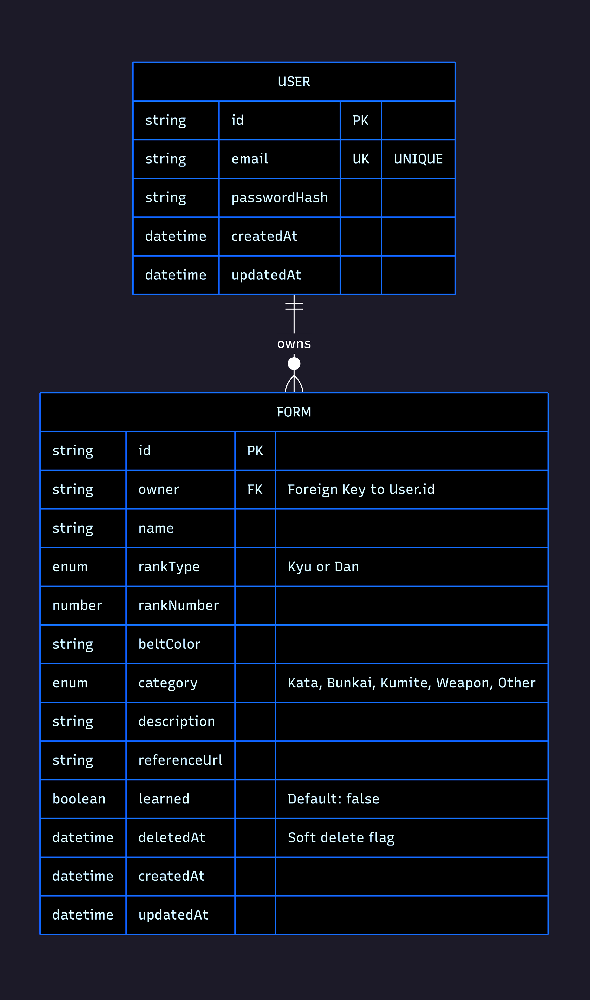

# Dojo App 🥋


_Dojo App home page interface_

A comprehensive full-stack martial arts forms management system built with the MEN stack (MongoDB, Express.js, Node.js). Designed specifically for Goju-Ryu practitioners to track their kata, bunkai, kumite, and weapon forms progression through the traditional kyu and dan ranking system.

---

## 👥 User Stories

- **As a martial artist**, I want to create an account so I can track my personal training progress
- **As a user**, I want to add new forms I'm learning so I can organize my practice schedule
- **As a practitioner**, I want to edit form details so I can update my learning status and notes
- **As a user**, I want to delete forms I no longer need but restore them if I made a mistake
- **As a martial artist**, I want to see visual progress charts so I can track my advancement through ranks
- **As a practitioner**, I want to view requirements by rank so I know what forms I need to learn next
- **As a user**, I want to categorize forms (Kata, Bunkai, Kumite, Weapons) so I can organize my training
- **As a martial artist**, I want to add reference URLs so I can access instructional videos for each form

---

## 🗄️ Database Design


_Entity Relationship Diagram showing the database structure_

---

## ✨ Key Features

### 🔐 User Authentication & Security

- **Secure user registration** with email validation and bcrypt password hashing
- **Session-based authentication** with MongoDB session store
- **User-scoped data** - each practitioner manages only their own forms
- **Protected routes** with authentication middleware
- **Security headers** via Helmet.js for protection against common attacks
- **Response compression** for improved performance

### 📋 Comprehensive Form Management

- **Full CRUD operations** for martial arts forms
- **Goju-Ryu specific data** including rank types (Kyu/Dan), belt colors, and categories
- **Form categories**: Kata, Bunkai, Kiso Kumite, Weapon, Other
- **Progress tracking** with "learned" status flags
- **Reference URLs** for instructional videos or documentation
- **Smart dropdown** with type-to-filter functionality for form names

### 🗑️ Advanced Data Management

- **Soft delete system** - forms are marked as deleted, not permanently removed
- **Trash management** - view and restore accidentally deleted forms
- **Hard delete option** for permanent removal
- **Duplicate prevention** - unique constraints per user for form/rank combinations
- **Database seeding** with traditional kata progression for testing

### 📊 Progress Analytics

- **Visual progress charts** showing form completion by rank using Chart.js
- **Requirements tracking** based on traditional Goju-Ryu syllabus
- **Belt progression visualization** with color-coded rank chips
- **Master forms reference** with traditional forms from white belt to 8th dan

### 🎯 Goju-Ryu Specific Features

- **Traditional ranking system**: 10th Kyu (White) to 8th Dan (Black)
- **Authentic form names** including Sanchin, Tensho, Seisan, Seipai, etc.
- **Weapon forms** including Bo, Sai, Tonfa, Nunchaku, and more
- **Requirements system** prevents curriculum inconsistencies

---

## 🛠 Tech Stack

### Backend

- **Node.js** - Runtime environment
- **Express.js** - Web application framework with security middleware (Helmet.js)
- **MongoDB** - NoSQL database with Mongoose ODM
- **bcryptjs** - Password hashing with 12 salt rounds
- **express-session** - Session management with MongoDB store
- **compression** - Response compression for performance

### Frontend & Templating

- **EJS** - Embedded JavaScript templating
- **Partial Components** - Reusable nav, head, footer, and error templates
- **Custom CSS** - Responsive design with Formation Sans font
- **Method Override** - Support for PUT/DELETE in forms
- **Chart.js** - Interactive progress visualization

---

## 📁 Project Structure

```
dojo-app/
├── models/
│   ├── User.js              # User authentication schema
│   └── Form.js              # Martial arts form schema with soft delete
├── routes/
│   ├── auth.js              # Authentication routes (login/signup/logout)
│   └── forms.js             # RESTful form CRUD operations
├── middleware/
│   └── requireAuth.js       # Authentication protection middleware
├── scripts/
│   ├── seed.js              # Database seeding with kata progression
│   └── sync-indexes.js      # MongoDB index synchronization
├── views/
│   ├── index.ejs            # Home page with animated Goju-Ryu logo
│   ├── new.ejs              # Create form with progress charts & requirements
│   ├── 404.ejs              # Page not found error template
│   ├── 500.ejs              # Server error template
│   ├── auth/
│   │   ├── login.ejs        # User login page
│   │   ├── sign-up.ejs      # User registration page
│   │   └── signup.ejs       # User registration page (alternate)
│   ├── forms/
│   │   ├── index2.ejs       # Forms listing with delete confirmation
│   │   ├── show.ejs         # Individual form details
│   │   ├── edit.ejs         # Form editing interface
│   │   └── trash.ejs        # Deleted forms management
│   └── partials/            # Reusable view components
│       ├── head.ejs         # Shared HTML head with meta tags
│       ├── nav.ejs          # Dynamic navigation (auth-aware)
│       ├── footer.ejs       # Shared scripts and footer
│       ├── errors.ejs       # Error message display component
│       └── history-arrows.ejs # Navigation arrow components
├── public/
│   ├── css/
│   │   ├── main.css         # Primary styling with custom fonts & animations
│   │   ├── chart.css        # Chart layout & belt progression styling
│   │   ├── nav-arrows.css   # Navigation arrow styling
│   │   ├── scroll.css       # Custom combobox & scrolling components
│   │   └── fonts/
│   │       └── Formation Sans Regular.ttf # Custom font family
│   ├── js/
│   │   ├── beltColors.js    # Belt color mapping and utilities
│   │   ├── chart.min.js     # Chart.js library (minified)
│   │   ├── main.js          # Primary JavaScript functionality
│   │   └── scroll-combo.js  # Custom combobox behavior
│   └── images/
│       ├── chi-i-do.png     # Martial arts organization logo
│       ├── dojoApp-erd.png  # Entity relationship diagram
│       └── home-page-logged-in.png # Screenshot for documentation
├── .env                     # Environment variables (not tracked)
├── .gitignore              # Git ignore patterns
├── db.js                   # Database connection configuration
├── package.json            # Dependencies and project metadata
├── package-lock.json       # Dependency version lock file
├── README.md               # Project documentation
└── server.js               # Express application setup with session handling
```

---

## 🚀 Getting Started

### Project Planning

**Project Planning**: [Dojo App Project Planning](https://trello.com/invite/b/68bcd7a74cee7fffb574acdc/ATTI1791e513c27783e74637a75085e5b30a951327AD/dojo-app-plan)

### Local Development

#### Prerequisites

- Node.js (v14 or higher)
- MongoDB (local or MongoDB Atlas)

#### Installation

1. **Clone the repository**

   ```bash
   git clone <your-repo-url>
   cd dojo-app
   ```

2. **Install dependencies**

   ```bash
   npm install
   ```

3. **Environment setup**

   ```bash
   # Create .env file
   MONGODB_URI=mongodb://localhost:27017/forms_db
   PORT=3000
   SESSION_SECRET=your-secure-session-secret
   NODE_ENV=development
   DEMO_EMAIL=demo@example.com
   DEMO_PASSWORD=demo123
   ```

4. **Initialize database**

   ```bash
   # Seed with traditional Goju-Ryu kata
   node scripts/seed.js

   # Sync database indexes
   node scripts/sync-indexes.js
   ```

5. **Start development server**

   ```bash
   nodemon server.js
   # or
   node server.js
   ```

6. **Access application**
   ```
   http://localhost:3000
   ```

---

## 📋 API Routes

### Authentication Routes

| Method | Route          | Description               |
| ------ | -------------- | ------------------------- |
| GET    | `/auth/signup` | User registration page    |
| POST   | `/auth/signup` | Create new user account   |
| GET    | `/auth/login`  | User login page           |
| POST   | `/auth/login`  | Authenticate user session |
| POST   | `/auth/logout` | Destroy user session      |

### Form Management Routes (Protected)

| Method | Route                | Description               |
| ------ | -------------------- | ------------------------- |
| GET    | `/`                  | Home page with navigation |
| GET    | `/forms`             | List user's forms         |
| GET    | `/forms/new`         | Create form with charts   |
| POST   | `/forms`             | Add form to database      |
| GET    | `/forms/:id`         | View form details         |
| GET    | `/forms/:id/edit`    | Edit form page            |
| PUT    | `/forms/:id`         | Update form data          |
| DELETE | `/forms/:id`         | Soft delete form          |
| GET    | `/forms/trash`       | View deleted forms        |
| POST   | `/forms/:id/restore` | Restore deleted form      |
| DELETE | `/forms/:id?hard=1`  | Permanently delete form   |

---

## 🗄️ Database Schema

### User Model

```javascript
{
  email: String (required, unique),
  passwordHash: String (required),
  timestamps: { createdAt, updatedAt }
}
```

### Form Model

```javascript
{
  owner: ObjectId (ref: User, required, indexed),
  name: String (required, min: 2 chars),
  rankType: Enum ['Kyu', 'Dan'] (required),
  rankNumber: Number (required, min: 1),
  beltColor: String,
  category: Enum ['Kata', 'Bunkai', 'Kumite', 'Kiso Kumite', 'Weapon', 'Other'],
  description: String,
  referenceUrl: String (URL validation),
  learned: Boolean (default: false),
  deletedAt: Date (soft delete),
  timestamps: { createdAt, updatedAt }
}
```

### Indexes

- **Unique constraint**: `{ owner, name, rankType, rankNumber }` (alive forms only)
- **Owner index**: Fast queries by user
- **Deletion filter**: Partial index excluding soft-deleted records

---

## 🥋 Traditional Goju-Ryu Integration

### Ranking System

- **Kyu Grades**: 10th (White) → 1st (Brown)
- **Dan Degrees**: 1st → 8th (Black)
- **Belt Colors**: White, Orange, Green, Purple, Brown, Black
- **Gradient Chips**: Visual representation of intermediate ranks

### Master Forms Reference

The application includes 48+ traditional forms across categories:

- **Foundation**: Sanchin, Tensho, Basic Kata series
- **Intermediate**: Geikisai series, Saifa, Seisan
- **Advanced**: Sanseiru, Kururunfa, Shisochin
- **Weapons**: Bo, Sai, Tonfa, Nunchaku, Kama
- **Master Level**: Kin Gai Ryu series

### Requirements Tracking

- **Kyu Requirements**: Forms needed for each belt promotion
- **Dan Requirements**: Advanced kata and weapon forms
- **Progress Charts**: Visual completion tracking by rank

---

## 🔧 Advanced Features

### Security Implementation

- **Multi-tenant architecture** with owner-scoped queries
- **Password security** using bcrypt with 12 salt rounds
- **Session management** with secure cookies and MongoDB storage
- **Input validation** at multiple layers (client, server, database)
- **Protection middleware** for authenticated routes

### Performance Features

- **Database indexing** for fast owner-scoped queries
- **Response compression** using compression middleware
- **Optimized aggregation** for progress analytics
- **Strategic data loading** for requirements and charts

### Development Tools

- **Database seeding** with authentic kata progression
- **Index synchronization** for schema management
- **Demo user setup** for easy evaluation
- **Environment configuration** for development workflow

---

## 🎯 Architecture Decisions

### Why MEN Stack?

- **Server-side rendering** optimal for form-heavy applications
- **Traditional POST/redirect** patterns work well for CRUD operations
- **Session-based auth** provides better control over user sessions
- **MongoDB flexibility** handles complex martial arts data structures

### Why Soft Deletes?

- **Data recovery** prevents accidental loss of training records
- **Audit trail** maintains complete history
- **User experience** allows mistake correction without permanent consequences

### Why Requirements System?

- **Single source of truth** prevents curriculum inconsistencies
- **Dynamic dropdown generation** ensures accurate form selection
- **Progress tracking** provides meaningful advancement metrics

---

## 🎯 Future Enhancements

### Planned Improvements

- Client-side form validation for better user experience
- Advanced search and filtering capabilities
- Export functionality for training logs
- Enhanced mobile responsiveness

### Potential Extensions

- Multi-dojo support with instructor roles
- Integration with video platforms for form demonstrations
- Achievement tracking and milestone badges
- Training pattern analytics

---

## 🙏 Attributions

- **Chart.js** - Data visualization library (https://www.chartjs.org/)
- **Formation Sans** - Custom font family for typography
- **Chi-i-do Organization** - Traditional Goju-Ryu syllabus and curriculum structure
- **ChatGPT** - Development assistance for implementing advanced features like soft delete patterns, security best practices, and database optimization strategies

---

## 🤝 Contributing

This project welcomes contributions from:

- **Goju-Ryu practitioners** with syllabus knowledge
- **Full-stack developers** interested in martial arts applications
- **UI/UX designers** for enhanced user experience
- **Database architects** for optimization recommendations

---

## 📄 License

This project is licensed under the MIT License.

---

## 🙏 Acknowledgments

- **Traditional Goju-Ryu syllabus** from Okinawan martial arts lineage
- **CHI-I-DO** (International Organization) for form standardization
- **Open source community** for the excellent MEN stack ecosystem

---

**Built with respect for traditional martial arts and modern development practices**
